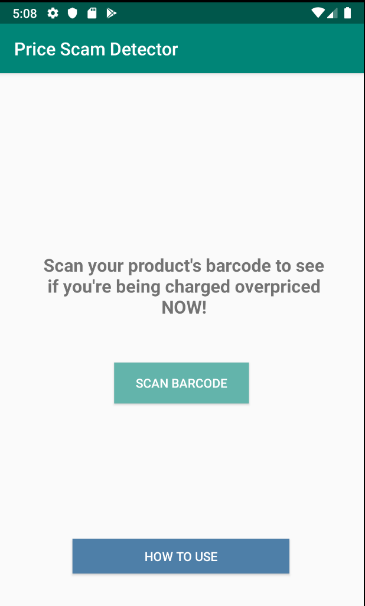
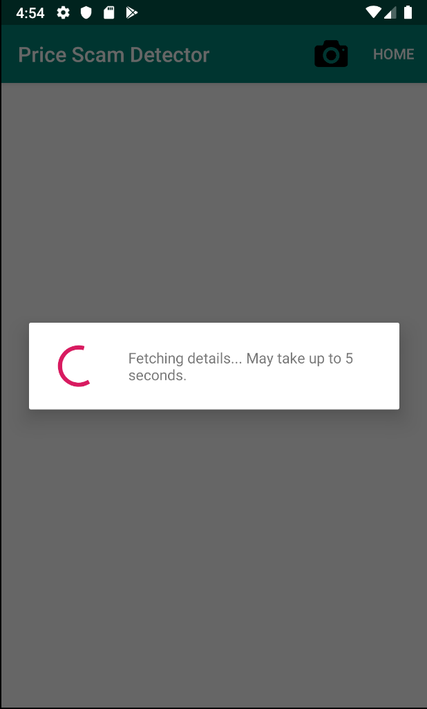
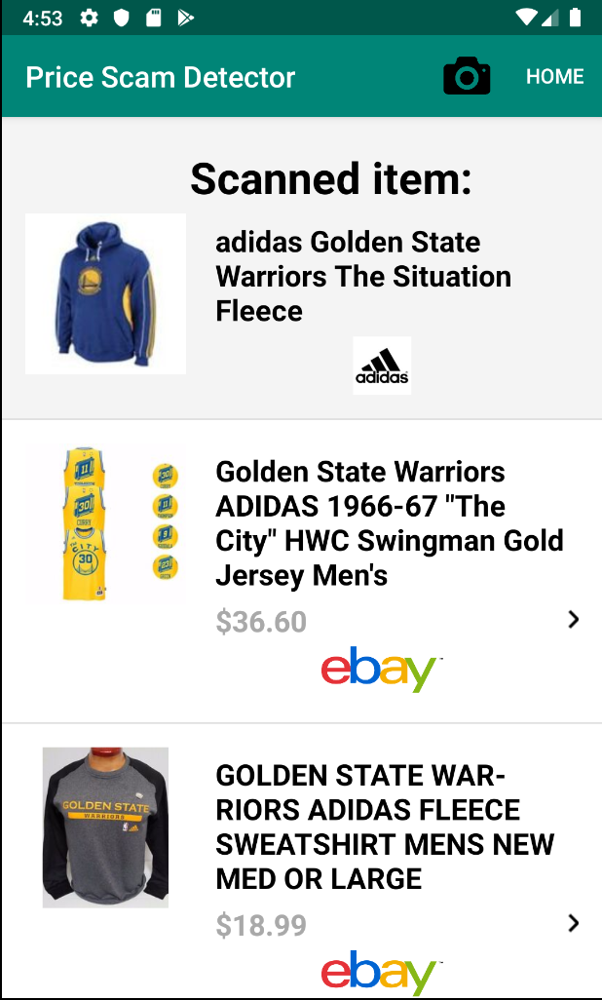
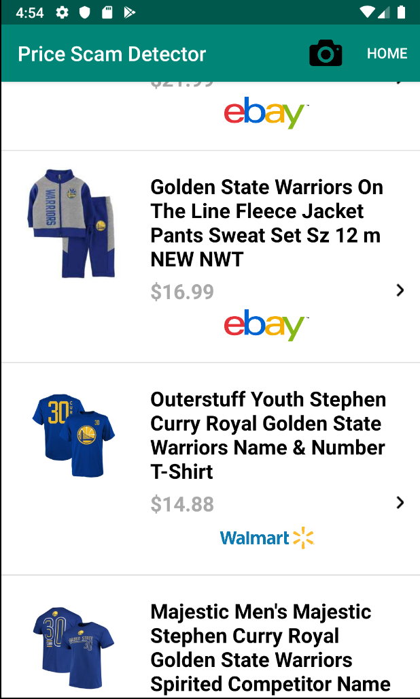

## [HACKTOBER FEST] How To Run the Android App:
1) Clone this repo by doing the command ```git clone https://github.com/yangray1/Price-Scam-Detector.git``` in bash terminal (For macOS and Linux users).
2) *Have Android Studio installed*. 
3) Open Android studio, select 'Open an existing Android Studio project' and select this Price-Scam-Detector folder.
4) Build and run the project on Pixel 2 API 28

If you have any problems running the app, let me know!

Items you can scan to test the app:
- A waterbottle's barcode
- Coke can's barcode

# Price Scam Detector

Upon scanning your product’s barcode, this app will fetch and display the prices for this product from Amazon, Ebay, and Walmart.

With this, you can determine whether the price you’re currently paying for is fair or not.
 
 

